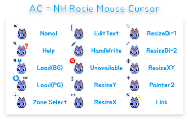

# Preview . . .

# AC-NH Rosie Mouse Cursor
this is my first mouse cursor theme, so it has bad quality... but.. it's CUTE!  
isn't right?  

# how to install
install / clone this repo and right click on `Install.inf`  
and you can see `Install` button on there!  
click that and check yes on prompt  
(the mouse cursor datas are on system folder; so it will requires admin permission; but is not install malwares!)  

then open windows search and type 'mouse cursor'  
and you can see `mouse pointer` settings; go down and click `additional mouse settings`  
(you should click that two times; idk why)  

and go pointer option; and set pointer theme to ACNH - Rosie; then you can see that your mouse is rosie!  

# special thanks
the install data file was based on Breeze mouse cursor!  
(but i edited it for me)  
